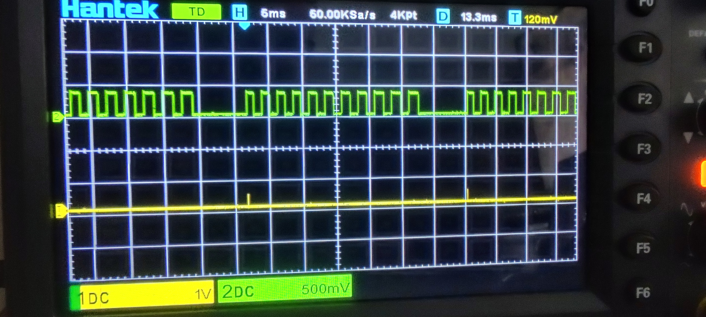

# Embedded Software 
 All the code for the Embedded Software course B31DG

# Arduino 
Arduino code is found in [main.ino](ArduinoCode/main/main.ino)

# ESP
Esp code found in [main.c](ESP/Coursework1/main/main.c)

# Demo

